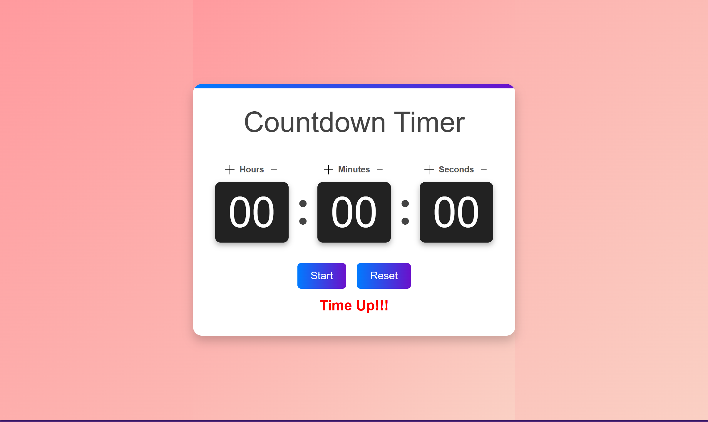

# Timer System

This is a Django-based countdown timer web application that allows users to set, pause, and reset a timer. The timer state is stored in Django sessions, enabling persistence across requests.

---

## Features
- Single Page Application (SPA) for seamless user experience.
- Set a countdown timer with hours, minutes, and seconds.
- Start, pause, and reset the timer.
- Timer persistence using Django session storage.
- Production-ready Django setup with error handling and security enhancements.
- Deployable with Docker and Heroku.
- **Live Demo**: Access the app live on Heroku at [https://lit-castle-92004-64995737305f.herokuapp.com/timer/](https://lit-castle-92004-64995737305f.herokuapp.com/timer/)

---

## Technologies Used
- **Django**: Backend framework for handling timer logic and session management.
- **JavaScript (ES6)**: Manages the UI interactions dynamically.
- **Axios**: Handles API requests for timer actions.
- **HTML/CSS**: Structures and styles the UI components.
- **Bootstrap (Optional)**: Used for styling improvements.
- **SQLite**: Default database for development.
- **Docker**: Containerization for deployment.
- **Heroku**: Cloud deployment.

---

## Project Structure

```
zeero/
│── manage.py               # Django project management script
│── requirements.txt        # Dependencies
│── Dockerfile              # Docker container setup
│── heroku.yml              # Heroku deployment config
│── db.sqlite3              # SQLite database (for development)
│── static/                 # Static files (images, JavaScript, styles)
│── timer/                  # Timer app (Django application)
│   ├── views.py            # Core logic handling timer operations
│   ├── models.py           # Database models (if needed)
│   ├── urls.py             # URL routes for timer API
│   ├── templates/
│   │   ├── timer.html      # Timer frontend template
│   ├── static/
│   │   ├── js/timer.js     # Timer JavaScript functionality
│   │   ├── styles/style.css # Timer styling
│── zeero/                  # Main Django project settings
│   ├── settings.py         # Django settings
│   ├── urls.py             # Project-wide URL configuration
│   ├── wsgi.py             # WSGI application entry point
```

---

## UI Functionality and User Flow



### **User Expectations**
- **Persistent Timer**: The timer state remains even after refreshing the page.
- **Start, Pause, Reset Controls**:
  - Clicking **Start** begins the countdown.
  - Clicking **Pause** stops the timer but retains the remaining time.
  - Clicking **Reset** restores the timer to the initially set duration.
- **Editable Time Input**:
  - Users can manually edit the displayed hours, minutes, and seconds.
  - Users can also increment/decrement values using the **+ and - buttons**.
- **Disabled Buttons**:
  - While the timer is running, the **+ and - buttons** are disabled to prevent modifications.
  - The **Start button** changes to **Pause** when active.
- **Time-Up Notification**:
  - When the countdown reaches zero, **"Time Up!!!"** appears in red.

---

## API Endpoints

### 1. **Set Timer**
- **Endpoint:** `POST /timer/set_timer`
- **Request Body:**
  ```json
  {
    "duration": 120, 
    "initialDuration": 120
  }
  ```
- **Response:**
  ```json
  {"success": true}
  ```
- **Functionality:** Starts a new timer session with the provided duration.

### 2. **Pause Timer**
- **Endpoint:** `PUT /timer/pause_timer`
- **Response:**
  ```json
  {"success": true}
  ```
- **Functionality:** Pauses the active timer and stores the pause time in the session.

### 3. **Reset Timer**
- **Endpoint:** `PUT /timer/reset_timer`
- **Response:**
  ```json
  {"success": true}
  ```
- **Functionality:** Resets the timer back to the initially set duration.

---

## Logic Overview

1. **Session-Based State Management:**
   - The timer duration, start time, and pause time are stored in Django sessions.
   - On page reload, the timer state is retained.

2. **Timer Logic:**
   - When the timer starts, the `start_time` is stored.
   - When paused, the `pause_time` is recorded.
   - On resumption, the remaining duration is calculated based on these timestamps.

3. **Frontend Integration:**
   - The UI dynamically updates the timer display via JavaScript.
   - API calls are made via `axios` for timer actions.

---

## Deployment Guide

### **Local Development**
#### **1. Clone the Repository**
```sh
$ git clone <repo-url>
$ cd timer_assessment
```

#### **2. Create a Virtual Environment**
```sh
$ python -m venv venv
$ source venv/bin/activate  # On Windows use `venv\Scripts\activate`
```

#### **3. Install Dependencies**
```sh
$ pip install -r requirements.txt
```

#### **4. Run Migrations & Start Server**
```sh
$ python manage.py migrate
$ python manage.py runserver
```

#### **5. Open in Browser**
Visit `http://127.0.0.1:8000/timer/` to use the timer.

---

### **Docker Deployment**
#### **1. Build and Run Docker Container**
```sh
$ docker build -t timer-app .
$ docker run -p 8000:8000 timer-app
```

#### **2. Open in Browser**
Visit `http://localhost:8000/timer/`.

---

### **Deploying to Heroku**
#### **1. Login to Heroku**
```sh
$ heroku login
```

#### **2. Create a New App**
```sh
$ heroku create timer-app
```

#### **3. Deploy to Heroku**
```sh
$ git push heroku main
```

#### **4. Run Migrations on Heroku**
```sh
$ heroku run python manage.py migrate
```

#### **5. Open the Deployed App**
```sh
$ heroku open
```

---

## Conclusion
This system provides a simple and effective countdown timer with API-based control. It can be run locally, in a Docker container, or deployed on Heroku for production use.

Let me know if you need further refinements! 🚀

