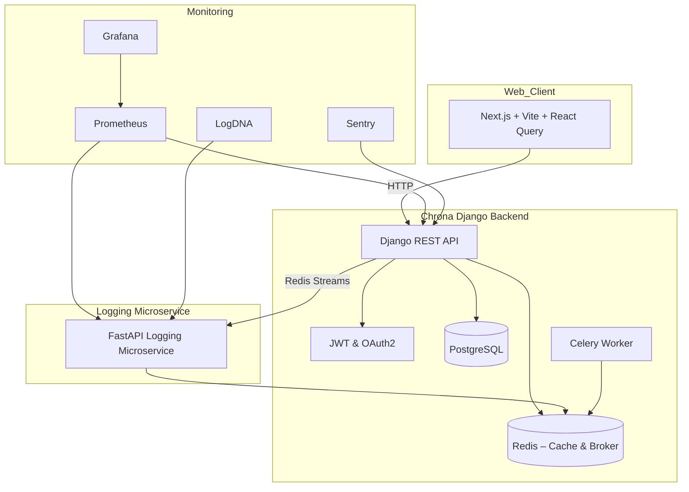

# 🕒 Chrona Backend

Chrona is a modern, production-ready countdown timer backend built with **Python**, **Django REST Framework**, and a supporting microservice ecosystem. Designed with precision, scalability, and observability in mind, Chrona delivers real-time countdown tracking, persistent session recovery, and cross-platform synchronization.

---

## ⚙️ Technology Stack

| Layer                    | Technology                                                                 |
|--------------------------|----------------------------------------------------------------------------|
| **Language**             | Python 3.11                                                                |
| **Framework**            | Django 5.1.7, Django REST Framework 3.16.0                                |
| **Authentication**       | JWT (via SimpleJWT), OAuth2 (via social-django-auth)                       |
| **Encryption & Hashing** | Fernet & Argon2                                                            |
| **Queue**                | Celery + Redis (for async task queuing)                                    |
| **Database**             | PostgreSQL                                                                 |
| **Cache/Broker**         | Redis                                                                      |
| **Logging**              | FastAPI logging microservice + Redis Streams                               |
| **Monitoring**           | Prometheus, Grafana, Sentry, LogDNA                                        |
| **Environment**          | Python-Decouple, `.env`-based modular settings (`base.py`, `prod.py`, ...) |
| **Infrastructure**       | Azure Container Apps + Terraform (IaC)                                     |
| **CI/CD**                | GitHub Actions (PR previews, blue-green deploys, test coverage)            |

---

## 📐 Architecture

Chrona backend is designed for **resilience**, **security**, and **modularity**. Using a **microservice-inspired architecture**, the core Django API is augmented with a logging service (FastAPI), Redis-powered real-time streams, and task workers that offload time-sensitive operations.

### 🧠 Key Concepts

- **Session Persistence**: Countdown states are preserved across sessions and devices.
- **Observable-by-Design**: Every user interaction (start, pause, resume) is logged and monitored via distributed tracing and real-time dashboards.
- **Decoupled Events**: Redis Streams relay timer events to downstream consumers like logging, analytics, and alerting services.

---

## 🧭 Mermaid Architecture Diagram

---

## 🛡️ Design Philosophy

- **Secure-by-default**: Follows OWASP top 10 compliance; applies token expiration handling, CORS control, HTTPS enforcement, and secrets isolation.
- **Cloud-Native**: Deploys on **Azure Container Apps**, orchestrated via **Terraform** for full Infrastructure-as-Code (IaC).
- **Zero-downtime**: Blue-green deployments with GitHub Actions ensure smooth rollouts.
- **Production-Tuned**: Includes Sentry crash monitoring, Prometheus metrics, and Grafana dashboards for operational visibility.
- **Future-Proof**: Modular design supports plug-and-play architecture for additional event consumers, analytics engines, or notification services.

---

## 📊 Observability Overview

- **Redis Streams** capture time events (start, pause, resume).
- **FastAPI logger** pushes structured logs to LogDNA.
- **Prometheus** scrapes system and app-level metrics.
- **Grafana** visualizes timer event throughput, queue latencies, and system health.
- **Sentry** catches runtime and API exceptions.

---

## 🔒 Security Posture

- JWT expiration and refresh workflows handled securely.
- Encrypt all PII or related PII.
- Social login integrations via OAuth2 providers.
- Separation of secrets using `python-decouple`, keeping codebase clean.
- Input sanitization and DRF serializers guard against payload tampering.

---

## 🔐 Encryption & Hashing

Chrona leverages **strong encryption** and **secure hashing** to protect all sensitive data both **at rest** and **in transit**:

### 🛡️ Token & Password Security
- **JWT Signing**: Access and refresh tokens are signed using `HS256` with high-entropy keys stored securely in environment variables.
- **Password Hashing**: Argon2 (based on Blake2b ) algorithm salts and hashes all user passwords before storage.

### 🔐 Field-Level Encryption
- **Fernet AES Encryption**: Sensitive user fields (e.g., emails, OAuth tokens) are encrypted using `cryptography.Fernet`, providing AES-128 GCM authenticated encryption.
- **Encrypted Fields**: Custom Django fields (e.g., `EncryptedCharField`, `EncryptedTextField`) are used to encrypt/decrypt transparently when reading/writing to the database.
- **Per-Environment Keys**: Encryption keys rotate per environment (dev, staging, production) and are never committed to the repository.

### 🔎 Hashing for Analytics & Telemetry
- **SHA-256 Hashing**: Where anonymization is required (e.g., for analytics or telemetry aggregation), identifiers are hashed securely without storing the raw values.
- **HMAC Signatures**: Deterministic HMAC signatures can be used when secure lookups are needed on encrypted fields (optional).

### 🛡️ Transport Security
- **HTTPS Everywhere**: Enforced TLS (HTTPS) on all frontend and backend endpoints to protect against MITM attacks.

---

### Test Coverage
- **Unit Tests**: 90%+ coverage across all modules
- **Integration Tests**: API endpoint testing
- **Security Tests**: Authentication and authorization testing
- **Performance Tests**: Load testing with Locust

---

## 🔄 CI/CD Pipeline

### GitHub Actions Workflow
1. **Code Quality**: Linting, formatting, security scanning
2. **Testing**: Unit tests, integration tests, security tests
3. **Building**: Docker image creation and optimization
4. **Deployment**: Blue-green deployment to Azure Container Apps
5. **Monitoring**: Health checks and rollback on failure

### Deployment Strategy
- **Blue-Green Deployment**: Zero-downtime deployments
- **Rollback Capability**: Automatic rollback on health check failure
- **Environment Promotion**: Dev → Staging → Production
- **Infrastructure as Code**: Terraform for reproducible infrastructure

---

## 🧩 Extensibility Roadmap

- ✅ Robust Unit and integration test suites
- ⏰ WebSocket-based real-time timer synchronization
- 📈 Event pipeline to a centralized analytics database (e.g., ClickHouse, TimescaleDB)
- 🧠 AI-generated timer suggestion engine
- 📬 Email and push notifications based on timer events
- 🔌 GraphQL API layer for enhanced client-side querying

---

## 👨‍💻 Author & Architecture

Crafted by **Miracle Adebunmi**, a full-stack engineer passionate about resilient systems, observability, and elegant API design.  
This project is a testament to modern software engineering, continuous deployment, and event-driven architecture.

> "Chrona is not just a timer — it's a real-time system observability showcase."

---