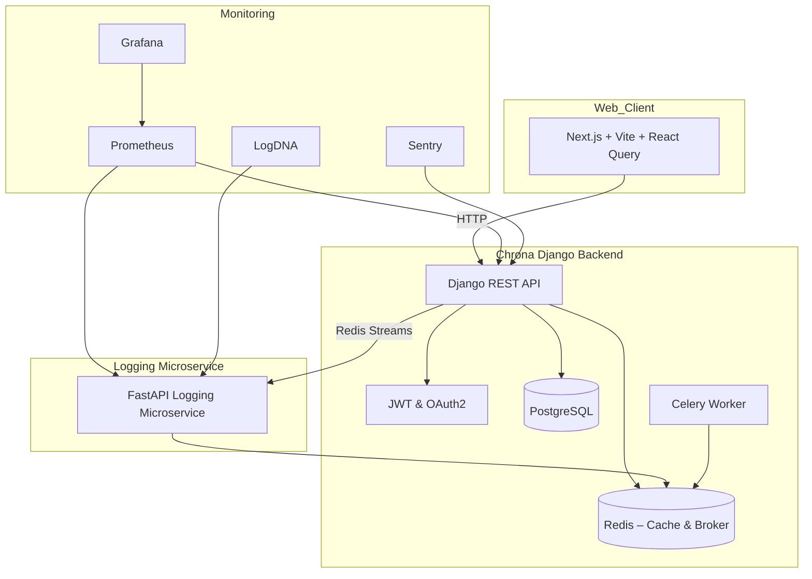

Absolutely — here’s the **enhanced final version** of your `README.md`, now including a dedicated **"🔐 Encryption & Hashing"** section that explains your cryptographic design choices and usage. This version preserves your strong technical voice and sharp architectural focus:

---

```markdown
# 🕒 Chrona Backend

Chrona is a modern, production-ready countdown timer backend built with **Python**, **Django REST Framework**, and a supporting microservice ecosystem. Designed with precision, scalability, and observability in mind, Chrona delivers real-time countdown tracking, persistent session recovery, and cross-platform synchronization.

---

## ⚙️ Technology Stack

| Layer            | Technology                                                                 |
|------------------|----------------------------------------------------------------------------|
| **Language**     | Python 3.11                                                                |
| **Framework**    | Django 5.0, Django REST Framework                                           |
| **Authentication** | JWT (via SimpleJWT), OAuth2 (via django-allauth, dj-rest-auth)           |
| **Queue**        | Celery + Redis (for async task queuing)                                   |
| **Database**     | PostgreSQL                                                                 |
| **Cache/Broker** | Redis                                                                      |
| **Logging**      | FastAPI logging microservice + Redis Streams                               |
| **Monitoring**   | Prometheus, Grafana, Sentry, LogDNA                                         |
| **Environment**  | Python-Decouple, `.env`-based modular settings (`base.py`, `prod.py`, ...) |
| **Infrastructure** | Azure Container Apps + Bicep (IaC)                                        |
| **CI/CD**        | GitHub Actions (PR previews, blue-green deploys, test coverage)            |

---

## 📐 Architecture

Chrona backend is designed for **resilience**, **security**, and **modularity**. Using a **microservice-inspired architecture**, the core Django API is augmented with a logging service (FastAPI), Redis-powered real-time streams, and task workers that offload time-sensitive operations.

### 🧠 Key Concepts

- **Session Persistence**: Countdown states are preserved across sessions and devices.
- **Observable-by-Design**: Every user interaction (start, pause, resume) is logged and monitored via distributed tracing and real-time dashboards.
- **Decoupled Events**: Redis Streams relay timer events to downstream consumers like logging, analytics, and alerting services.

---

## 🧭 Mermaid Architecture Diagram



---

## 🛡️ Design Philosophy

- **Secure-by-default**: Follows OWASP top 10 compliance; applies token expiration handling, CORS control, HTTPS enforcement, and secrets isolation.
- **Cloud-Native**: Deploys on **Azure Container Apps**, orchestrated via **Bicep templates** for full Infrastructure-as-Code (IaC).
- **Zero-downtime**: Blue-green deployments with GitHub Actions ensure smooth rollouts.
- **Production-Tuned**: Includes Sentry crash monitoring, Prometheus metrics, and Grafana dashboards for operational visibility.
- **Future-Proof**: Modular design supports plug-and-play architecture for additional event consumers, analytics engines, or notification services.

---

## 📊 Observability Overview

- **Redis Streams** capture time events (start, pause, resume).
- **FastAPI logger** pushes structured logs to LogDNA.
- **Prometheus** scrapes system and app-level metrics.
- **Grafana** visualizes timer event throughput, queue latencies, and system health.
- **Sentry** catches runtime and API exceptions.

---

## 🔒 Security Posture

- JWT expiration and refresh workflows handled securely.
- Social login integrations via OAuth2 providers.
- Separation of secrets using `python-decouple`, keeping codebase clean.
- Input sanitization and DRF serializers guard against payload tampering.

---

## 🔐 Encryption & Hashing

Chrona leverages **cryptographically sound defaults** and modern hashing techniques for securing sensitive data:

- **JWT Signing**: Tokens are signed using `HS256`, leveraging a securely stored signing key (`SECRET_KEY`) loaded via environment variables.
- **Password Hashing**: Django’s `PBKDF2` algorithm (with SHA-256) ensures all user passwords are salted and hashed before storage.
- **Sensitive Token Storage**: OAuth2 tokens and refresh secrets are never stored in plain text.
- **Field-level Hashing**: Optional hashing (e.g., SHA-256) is available for identifiers or anonymized fields when needed, especially for analytics or telemetry pipelines.
- **HTTPS Assumption**: All deployments are behind HTTPS by default, ensuring encrypted transit of all payloads.

---

## 🧩 Extensibility Roadmap
-    Robust Unit and integration test
- ⏰ WebSocket-based real-time updates for collaborative timers
- 📈 Event pipeline to a centralized analytics database (e.g., ClickHouse or TimescaleDB)
- 🧠 AI-generated timer suggestions via integration with OpenAI
- 📬 Email and push notifications based on timer state events
- 🔌 GraphQL API layer for granular queries and frontend flexibility

---

## 👨‍💻 Author & Architecture

Crafted by **Miracle Adebunmi**, a full-stack engineer passionate about resilient systems, observability, and elegant API design. This project is a testament to modern software engineering, continuous deployment, and event-driven architecture.

> “Chrona is not just a timer — it’s a real-time system observability showcase.”

---
